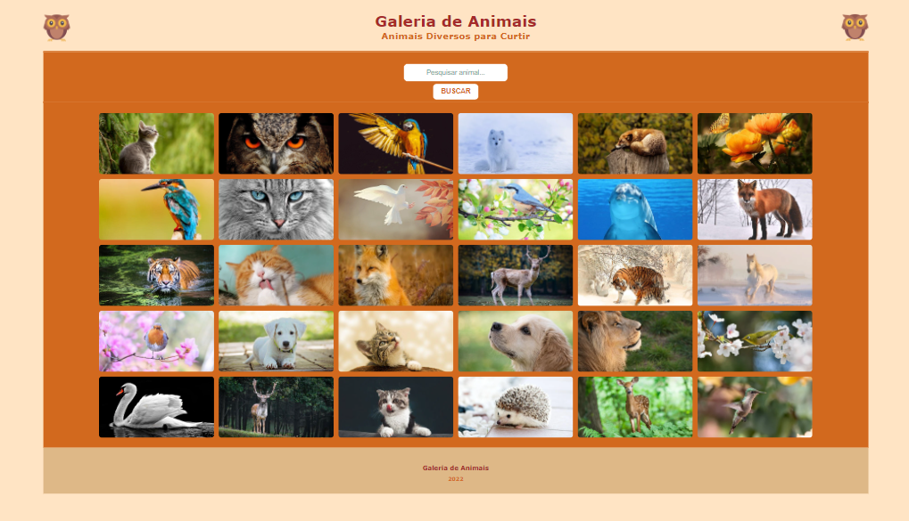
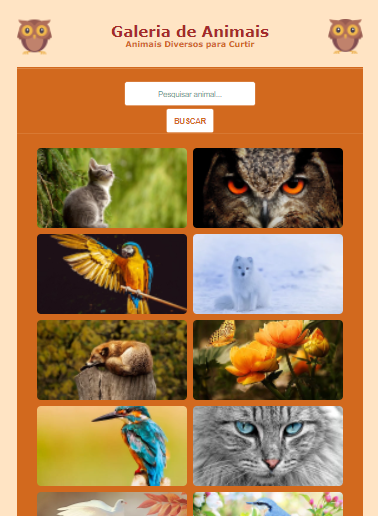

## Site Galeria de Animais
### Projeto React Js

#### Link do Projeto: <a href="https://katarinealbuquerque.github.io/site-galeria-animais-reactjs/">Abrir Site Galeria de Animais</a>

## I. Sobre o Projeto

##### O Projeto é patrocinado pela Digital Innovation One, a DIO; para treinamento final de front-end em React Js.

##### O trabalho foi feito para por em prática os conhecimentos adquiridos em aula, utilizando tecnologias como, Javascript, HTML5 e CSS3. Tudo isso integrado e sendo componentizado no React Js.

##### O objetivo é criar uma aplicação funcional em React Js com todas as suas implementações, e assim desenvolver um conceito lógico, estruturado e organizado da tecnologia.

##### A aplicação consiste em consumir uma API criada por minha autoria, utilizando imagens online da Pixabay, para uso não comercial, apenas para estudos.

## II. Layout do Projeto

<h3>Mobile</h3>

## III. Tecnologias Utilizadas

* HTML5
* CSS3
* Javascript
* React Js

## IV. Executando o Projeto

* Abra o terminal
* Acesse o caminho: cd kba-galeria-animais
* Execute o comando **npm install** para instalar as dependências.
* Depois execute **npm start** para abrir o projeto no navegador.

## V. Autor

##### Katarine Bezerra de Albuquerque

##### Linkedin: <a href="https://www.linkedin.com/in/katarine-albuquerque/">/katarine-albuquerque</a>

##### GitHub: <a href="https://github.com/KatarineAlbuquerque">/KatarineAlbuquerque</a>
